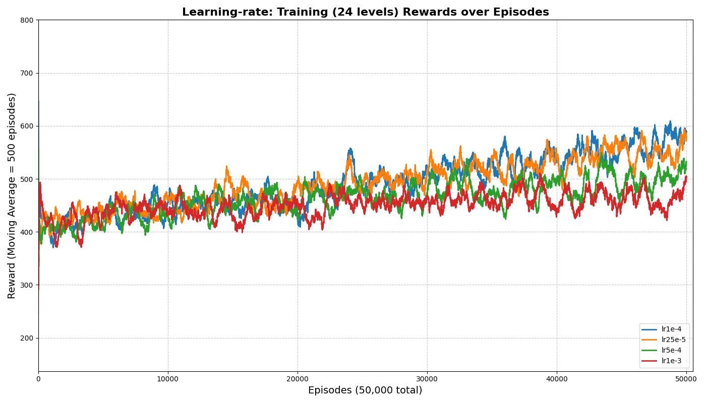
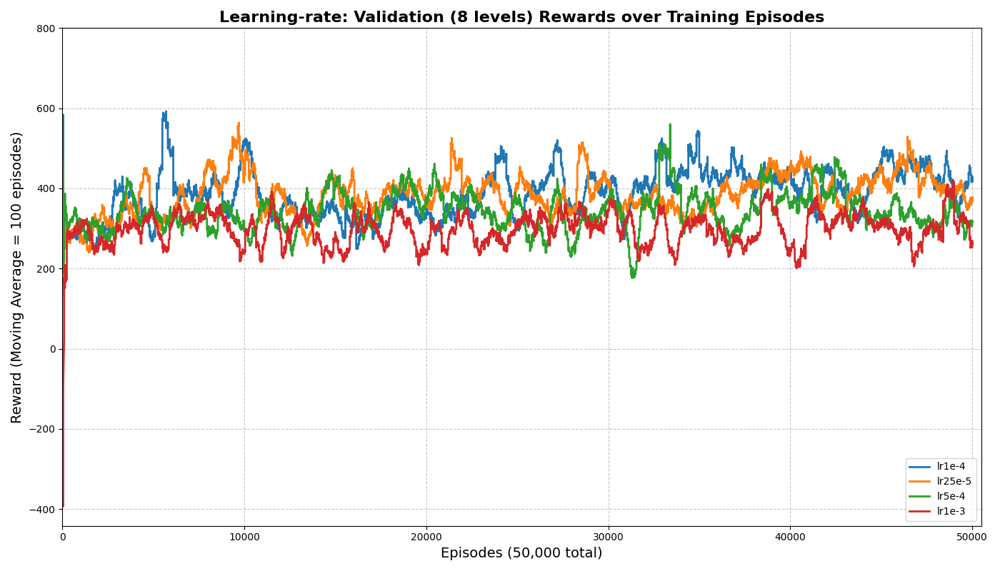

# It’s-a Me, Super Mario Bros RL Agent! Wahoo!

## Setup Guide
- Install python version 3.10
- pip install -r requirements.txt
- python3.10 test.py

for conda environments: 
```pip install torch torchvision torchaudio --index-url https://download.pytorch.org/whl/cu121```


## Files:
- train.ipynb     for training agents, validation runs concurrently 
- plot.py         for plotting figures
- test_500.ipynb  for testing a model on selected stages

## DQN implementation:
- agent.py
- agent_nn.py
- wrappers.py 

### Learning Rate Tuning


